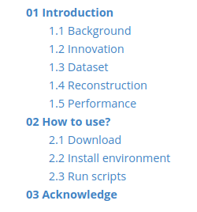
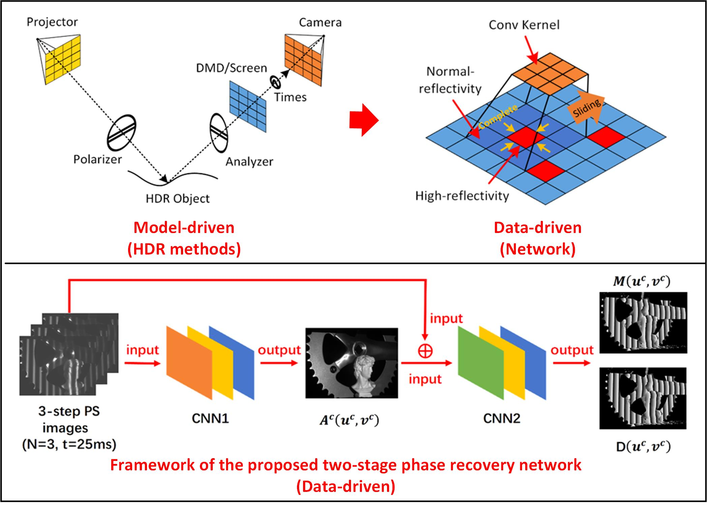
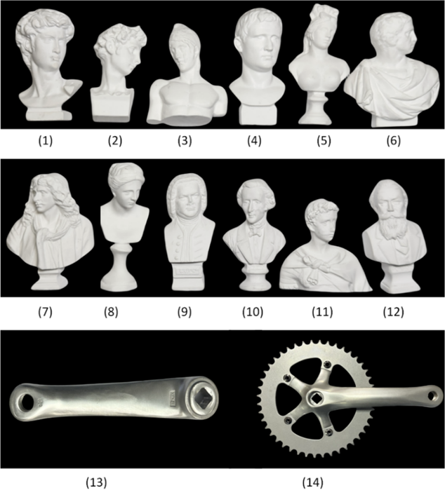
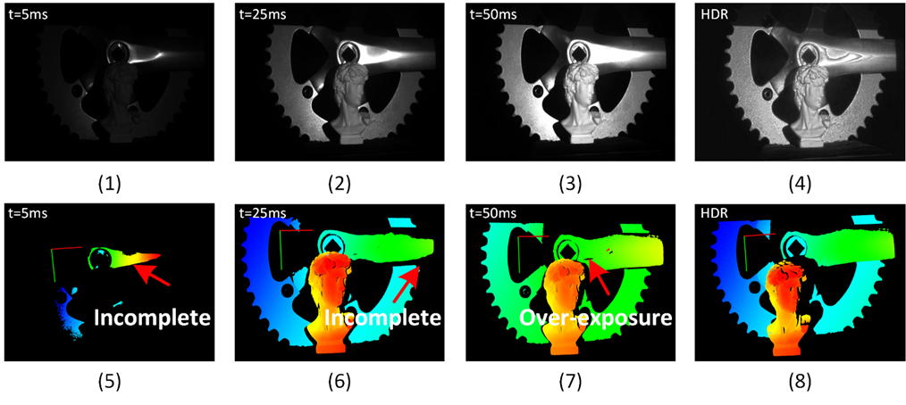
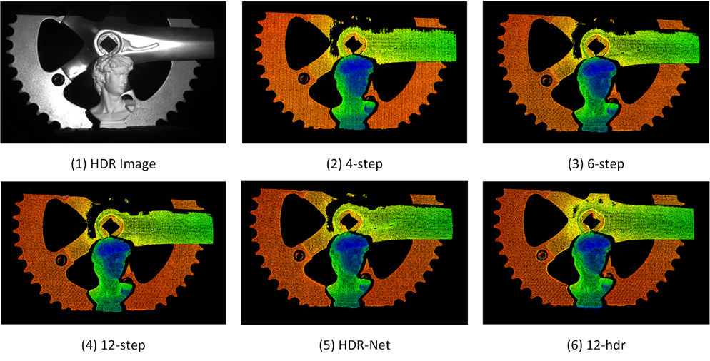
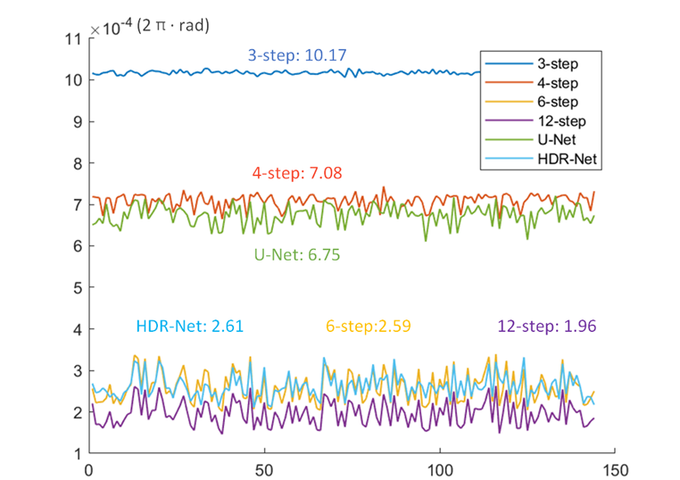
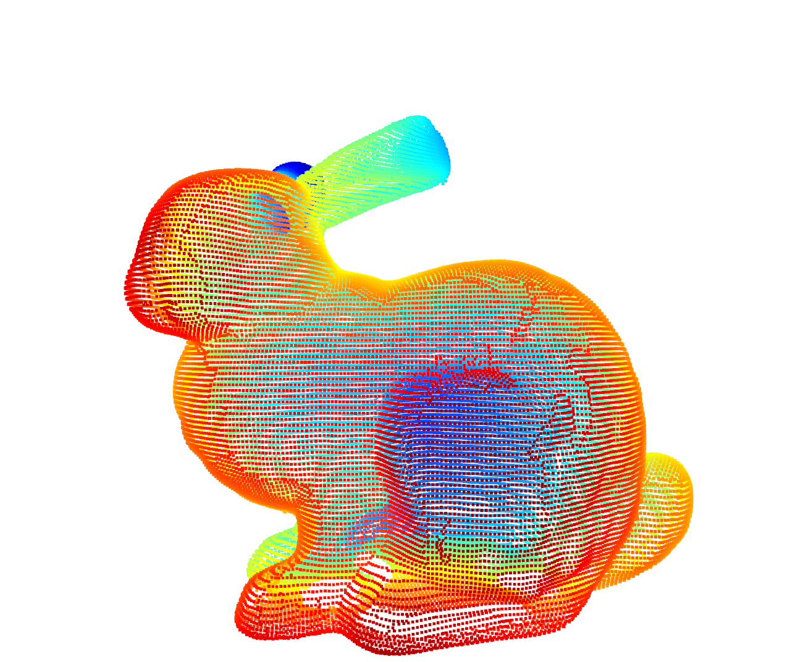
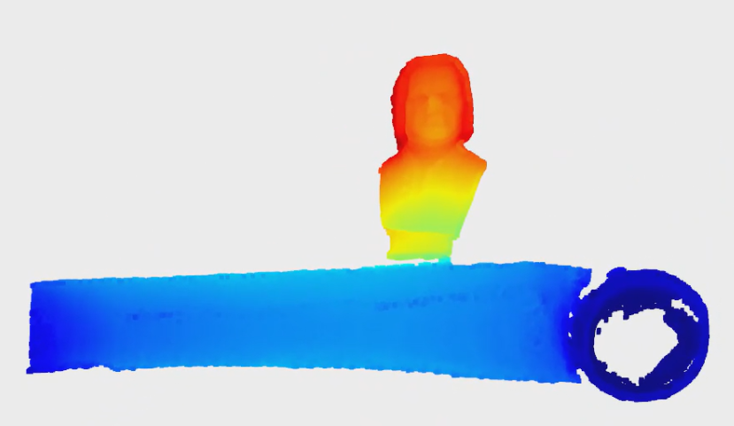

This paper is processing in "Optics Express". A preprint version is avaiable at URL: https://doi.org/10.1364/opticaopen.25864942

The dataset is avaiable at the baidu pan:

Link：https://pan.baidu.com/s/1iGAlyMaGhI73LmuKyJhWSQ?pwd=qzwp 

Code：qzwp 


# 01 Introduction

| **** |
| :----------------------------------: |
|      **Fig. 1 Graph abstract**       |

## 1.1 Background

In recent years, the fringe projection profilometry (FPP) has been widely applied in industry domain because of its merits, e.g., speed, accuracy, and non-contact, etc. The N-step phase-shift (PS) algorithm can work well on most scenes, but often fails in high-dynamic-range (HDR) scenes. 

The traditional HDR techniques mainly include three categories: multi-exposure (ME), adjust-projection (AP), and polarization (PL) methods. However, these methods both have drawbacks: 

1. **ME**: These methods have to take a lot of images with different exposure times, which is time consuming for the measurement; 
2. **AP**: These methods have to adjust fringe patterns repeatedly (Because the projector unable to directly "see" the over-exposure pixels);
3. **PL**: These methods utilize a polarizer and a analyzer to filter out specular reflection that it is inevitably lead to the decrease of signal-to-noise ratio (SNR) of images. 

The essence of the PS algorithm is to calculate the following funciton:


The network-based methods have a large number of neurons to fit it effectively.  In this paper, we descussed "Application of deep network in the FPP techinqe on HDR scenes by an end-to-end method".

## 1.2 Innovation

Although the network-based methods have achieved significant sucess, but there are still two questions of the previous research:

1. **Benchmark**: Lacks of a public datast and evalution to evaluate the performance of different algorithms. 
2. **Pipeline:** Lack of  a complete network-based method's pipeline includes network training, phase calculate, 3D reconstruction, and filtering and display of point clouds.

To this end,  a HDR network (Fig. 1) contains two CNN networks and a dataset contains 720 HDR scenes (Fig. 2) were proposed, as follows.

1. **HDR-Net：** The performance of our method is compare to the 6-step PS algorithm, while the U-Net method is only compare to 4-step Ps algorithm. Compared with the other phase networks, the CNN1 firstly outputs the texture $A$ of object, and then take it with the original images as the input for CNN2 to predicit the numerator $M(u^c,v^c)$ and denominator $D(u^c,v^c)$. Once the numerator $M(u^c,v^c)$ and the denominator $D(u^c,v^c)$ are obtained, the wrapped phase ${\varphi ^c}\left( {{u^c},{v^c}} \right)$ can be calculated by Eq. (1). 
2. **Dataset:** A dataset contains 720 HDR scenes was collected in this paper. Dataset's details is described in the section 1.3. 
3. **Pipeline:** A complete baseline demo is introduced, including network training, phase calculation, 3D reconstruction, and filtering and display of point clouds.

## 1.3 Dataset

A dataset was collected in this paper, as follows:

|  |
| :----------------------------------------------------------: |
| **Fig. 2 A HDR dataset of the FPP technique. (1) ~ (12): Plaster models (Normal-reflectivity); (13) ~ (14): Metal models (Mixed-reflectivity).** |

|  |
| :----------------------------------------------------------: |
| **Fig.3 A typical HDR scene and the 3D reconstruction results with 12-step PS algorithm. (1)-(3): LDR images with different exposure times: 5ms, 25ms, 50ms; <br />(4): HDR image; (5-7): the 3D reconstruction results with LDR images; <br />(8): the 3D reconstruction result of HDR image.** |

## 1.4 Reconstruction

|  |
| :----------------------------------------------------------: |
| **Fig. 4 Qualitative comparison of the 3D reconstruction with the different PS algorithms: 4-step, 6-step, 12-step, HDR-Net, and 12-step (HDR) (Scene-25).** |

## 1.5 Performance

|  |
| :----------------------------------------------------------: |
| **Fig. 5 Qualitative comparison of the absolute phase ϕ with the different PS algorithms: 3-step, 4-step, 6-step, 12-step, U-Net, and HDR-Net PS algorithms (Test-set, 144 scenes).** |

# 02 How to use?

## 2.1 Download

Firstly, to download the code from this repository, as follows:

```sh
git clone https://github.com/SHU-FLYMAN/HDR-NET.git
```

Then download the dataset from Google Drive or Baidu Drive (after the paper is received), and unzip it into the directory `./Data`.

## 2.2 Install environment

**You have to install the requirement with the following scripts:** 

```sh
# GTX 4090, nvidia driver=535.171.04
conda create -n HDR-NET python=3.8	# crate a python 3.8 or 3.10 env (tested)
conda activate HDR-NET				# activate conda env

# pytroch2.2 with GPU
conda install pytorch torchvision torchaudio pytorch-cuda=12.1 -c pytorch -c nvidia
pip install tensorboard			    # conda will be complicit with the previous envs

conda install -c conda-forge opencv # opencv4.9
conda install tqdm					# install tqdm
conda install scipy					# install scipy
```

**You have to test the `cuda` whether it is available?**

```python
# code
import torch
import torchvision

print("Torch version:", torch.__version__)
print("Torchvision version:", torchvision.__version__)
print("CUDA available:", torch.cuda.is_available())
print("CUDA version:", torch.version.cuda)

# result
Torch version: 2.2.2
Torchvision version: 0.17.2
CUDA available: True
CUDA version: 12.1
```

**if you want to display the 3d reconstruction result, you have to install the `open3d` library, as follows:**

```sh
pip install matplotlib			    # conda will be complicit with the previous envs
conda install scikit-learn			# scikit-learn 1.3.0
pip install open3d 				    # x86_64, arm64
```

**Downloading `open3d-0.18.0-cp311-cp311-manylinux_2_27_x86_64.whl (399.7 MB)`** 

**If you are in China, you can use the following cmds:**

```sh
pip install open3d -i https://pypi.tuna.tsinghua.edu.cn/simple
```

**You have to restart the computer, and to verify the `open3d` library whether is installed successful, as follows:**

```sh
import open3d as o3d

if __name__ == '__main__':
    pcd = o3d.io.read_point_cloud(r"./Data/bunny.ply") 
    print("number of points：", pcd) 
    o3d.visualization.draw_geometries([pcd])  
```

**If the `open3d` is installed successful, a `bunny` will be displayed at the viewer:**

| **** |
| :----------------------------------------------------------: |
|                    **Fig. 6 `bunny.ply`**                    |

## 2.3 Run scripts

`````sh
# 01 process dataset
python step1.processData.py
# 02 train network
python step2.train.py
# 03 test network
python step3.test.py
# 04 3d reconstruction
python step4.reconstruct3d.py
`````

1. The total time for training the network with 150 epochs is cost about 8 hours for a GTX 4090. A pre-trained weight can be download from Google Drive or Baidu Drive, and place it at directory `./logs` .
2. Parameters can be modified in `config.py` , and details of them are explained in the config script.

The results as follows:

|  |
| :----------------------------------------------------------: |
| **Fig. 7 3D reconstruction result of scene-604 with the HDR-Net method (Open3D)** |

# 03 Acknowledge

Currently, this work is processing in the journal "Measurement":

> "HDR-Net: A two-stage phase network of fringe projection profilometry for high-dynamic-range scenes", 

This work is supported by the following funds:

> National Natural Science Fund of China (No. 52327805, No. 62176149) and China Scholarships Council (CSC No. 202206890082).


